# Soldering Essentials

by Ryan Vasquez

## Table of Contents

[Credits](#Credits)

# Theory Of Soldering

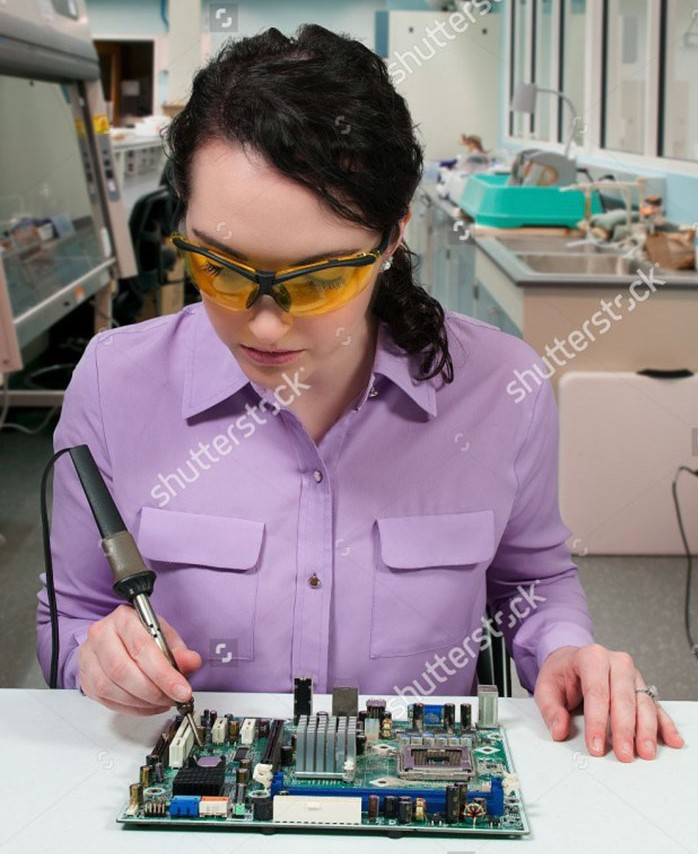
The purpose of soldering is to join to electronic components together.
Usually this it is to join a component to a circuit board.  
In order for the two parts to join properly there many conditions that
need to be met first. When soldering is done incorrectly, it can cause
electronics to not work or fail later on in their life. The following
sections in the theory of soldering will describe some of the basics for
soldering correctly.

[Soldering Iron Tip Selection and Preparation](#soldering-iron-tip-selection-and-preparation)

## Soldering Iron Tip Selection and Preparation

### Conical Soldering Tips

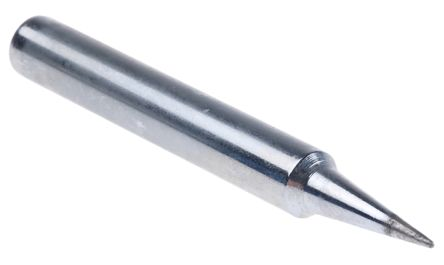  
Conical Soldering iron tips may seem like an obvious choice for SMD
soldering, but they aren't always the best because they do not transfer
heat as well due to the small tip. Small tips are not necessary to do
fine pitch SMD soldering. Good flux is necessary for fine pitch solder.
A small tip alone will not prevent solder bridging while soldering.
Conical soldering iron tips usually have a very fine point, this means
that they have less surface area that they can use to transfer heat. In
order for solder to properly [wet](#soldering-wetting) the component and
pcb pad, they must both be above the solders melting point. (About
360°C/ 680°F for Sn63Pb37). In order to help conical soldering tips
transfer heat better, it is recommended to add a small dab of solder to
the tip of the iron to help increase its effective surface area. One
other thing conical soldering iron tips are good at doing is touching up
small solder joints without disrupting components around them.

##### Recap

Advantages:
1. Small tip for very fine work.
2. Can get into small corners unreachable by other tips.
3. Doesn't disturb nearby solder joints

Disadvantages:
1. Small tip doesn't transfer heat very well, it may be hard to heat up
   larger components and pads with this tip.
2. Sometime can be sharp and remove [soldermask](#soldermask) if not
   careful.
3. Small tip can't wick much solder for drag soldering or drag solder
   removal.

### Flathead(Chisel) Soldering Tips

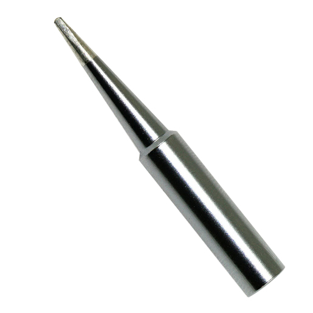  
Chisel Soldering tips are the most versatile solder iron tips. They can
solder big and small components to a PCB. They have a larger surface
area and can do a better job of heating of the component and pcb. It is
also possible to solder fine pitch SMD components using
[drag soldering](#drag-soldering) and flux.

##### Recap

Advantages:
1. Bigger heat reservoir
2. Larger contact surface area can most easily heat component leads and
   pcb
3. Can hold more solder on tip for drag soldering

Disadvantage:
1. Larger top can disturb nearby components or leads.
2. Can't reach tight spaces, like the corners of QFN packages.

## Solder Tip Preparation

When you first turn a soldering iron on, there will be corrosion on the
tip of the soldering iron. In order to solder you have to transfer heat
from the soldering iron to the part. The Oxide layer on the tip on the
soldering iron act as thermal insulation so it must be cleaned off.

### How to tin a soldering iron tip

This is an oxidized soldering iron tip.
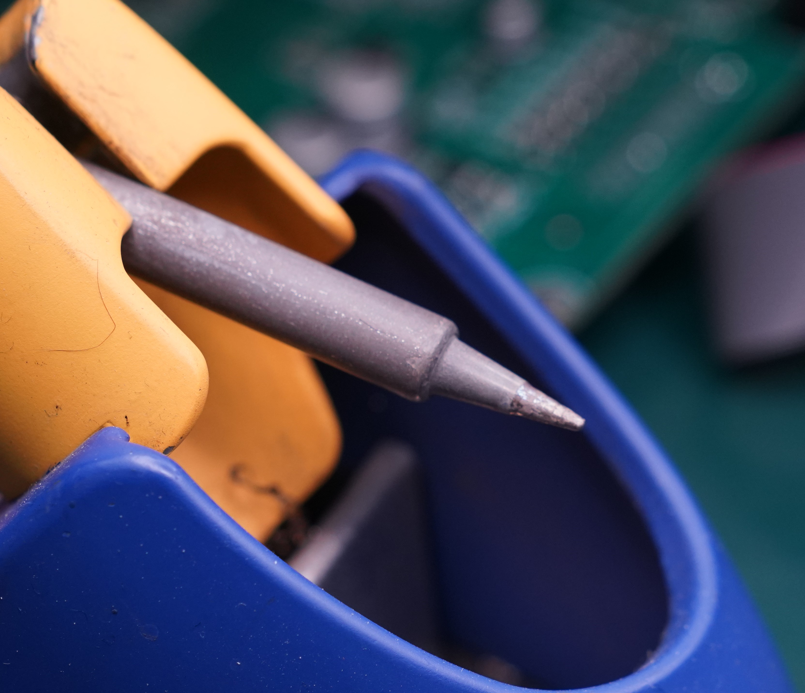
1. Add Solder to the tip. This adds fresh tin and lead to the tip along
   with flux. The flux will help to dissolve the oxide layer off the tip
   of the soldering iron.
   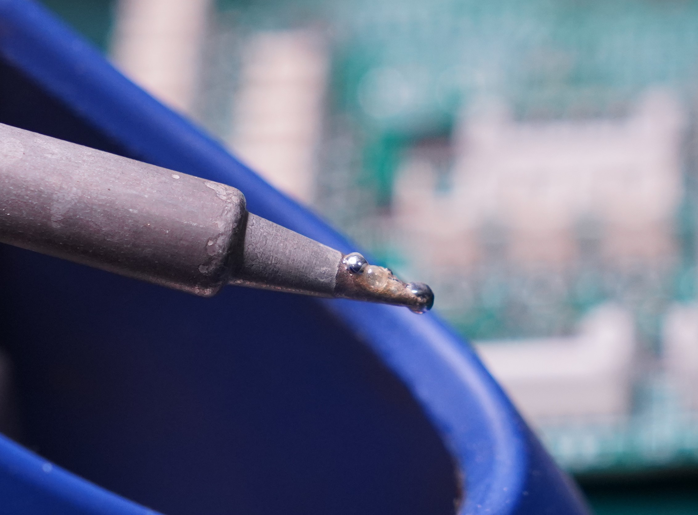
2. Rub the soldering iron in the brass sponge to rub the oxide layer off
   of the tip. 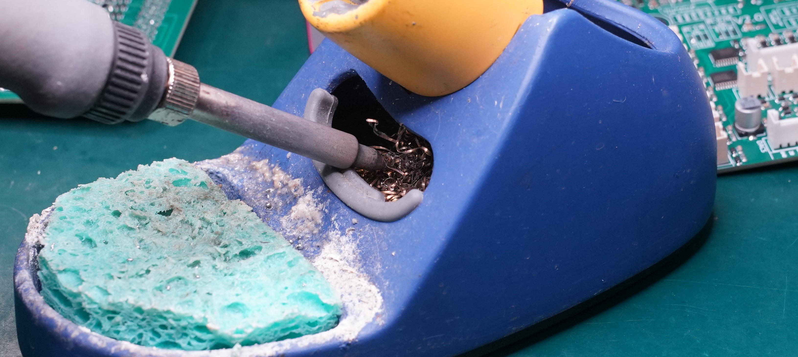  
   Repeat steps 1 and 2 until the soldering iron is shiny and clean with
   no dull spots.
3. Remove extra solder from the tip using a wet sponge.
   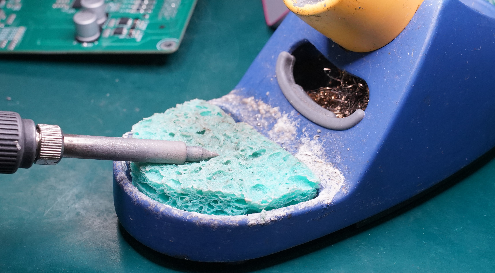
4. Your solder tip should nice and shiny as shown in the photo.
   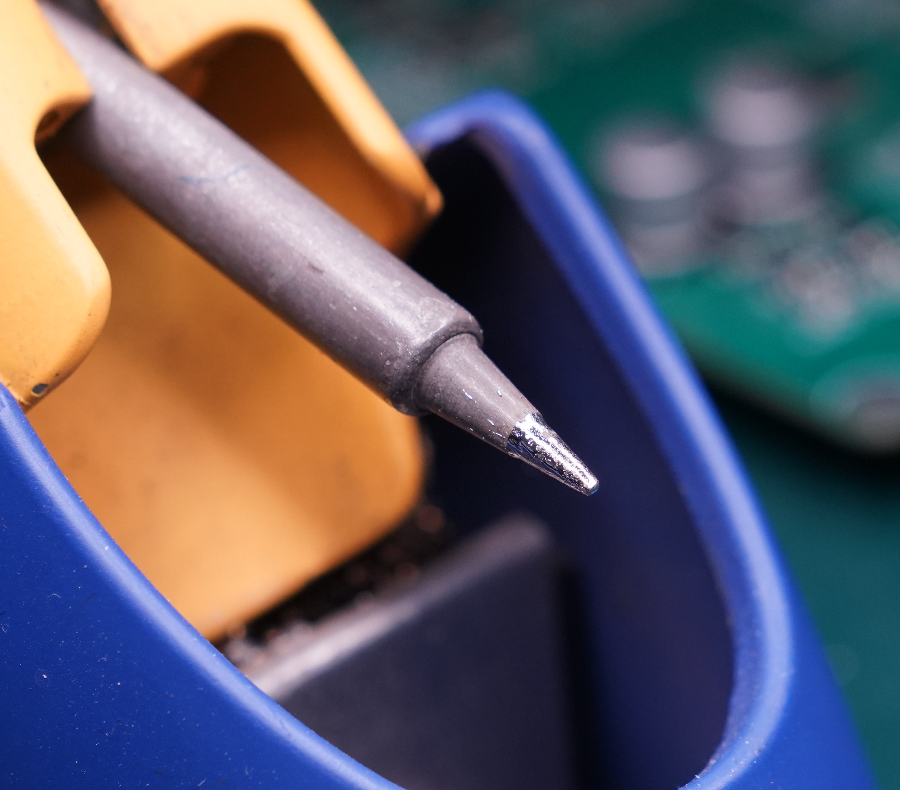

## Fluxes: How to choose them, use them, and clean them

### What is flux?

Flux is a acid that dissolves the oxides on the part and the pcb. This
will ensure the solder has good mechanical and electrical joint. The
flux will make the oxides float to the outside of the solder joint for
easy cleaning. The flux residue left on the pcb after soldering contains
the oxides. Most fluxes are also most acidic at soldering temperature
than at room temperature.

### Different Kinds of Flux

#### Rosin Flux

- Acidity at room temp: Medium
- Acidity at soldering temp: Medium-Strong.
- Difficulty to clean: Difficult, must use strong solvent like alcohol
  or PCB cleaners.
- Damage to circuits: Conductive, Attracts dust and moisture, can damage
  IC and smd components.
- Time to solder: This type flux lasts a medium amount of time compared
  to other fluxes.

Rosin Flux is the most common type of flux found in solder wire and flux
pens. It leaves a dark residue on a pcb especially when heated for a
long period of time. Once cool, rosin core solder is sticky and can
attract dust and other debris to the PCB leading to short circuits. In
some cases leaving rosin flux on PCBs for a long period of time can lead
to conductive areas of the flux between components. This will cause
malfunctions for sensitive circuits like measurement circuits are high
impedance/impedance sensitive communication like USB or I2C. The flux
can also dissolve traces over time if there is enough flux left over the
board. To clean rosin core flux from PCB, you must use 70%+ isopropyl
alcohol and a brush(tooth brush) to properly remove the flux.

#### No-Clean Flux

- Acidity at room temp: None, This is why its called no clean.
- Acidity at soldering temp: Weak.
- Difficulty to clean: Hard/No Effort, must use strong solvent like
  alcohol or PCB cleaners if you want to remove it.
- Damage to circuits: No damage to circuits. It may be conductive in
  some cases.
- Time to solder: This solder does not last long at soldering
  temperatures. It will degrade very quickly so solder joints must be
  made fast when using this type of flux in soldering.

This type of solder is typically used in applications where the PCB's
can't be cleaned such as....when doing repairs to PCB's can't be removed
for cleaning, or when soldering on components that can't be cleaned like
humidity sensors or buzzers.

#### Water Soluble flux

- Acidity at room temp: High
- Acidity at soldering temp: Very High
- Difficulty to clean: Easy, wash the pcb in warm/hot water to clean
  flux off. Also use a toothbrush to scrub any burned flux.
- Damage to circuits: This Flux is extremely acidic and will dissolve
  IC's, resistors, capacitors, and pcb traces if not cleaned off. Clean
  off within 12 hours to avoid damage to circuit.
- Time to solder: This flux lasts a long time on a solder joint when
  soldering. Allows for lots of repositions before needing more flux.

This type of solder is typically used in a hand building of circuit
boards and pick and place application because of its easy cleaning. No
special chemicals are required to clean this flux from a PCB, just
water. Most PCB manufactures will put PCBs through a PCB washer similar
to a dish washer.

#### Cleaning Flux / General PCB cleaning

PCB's must be cleaned with no flux residue left except for no clean
fluxes. Below is what happens when flux is left on a PCB for an extended
period of time.

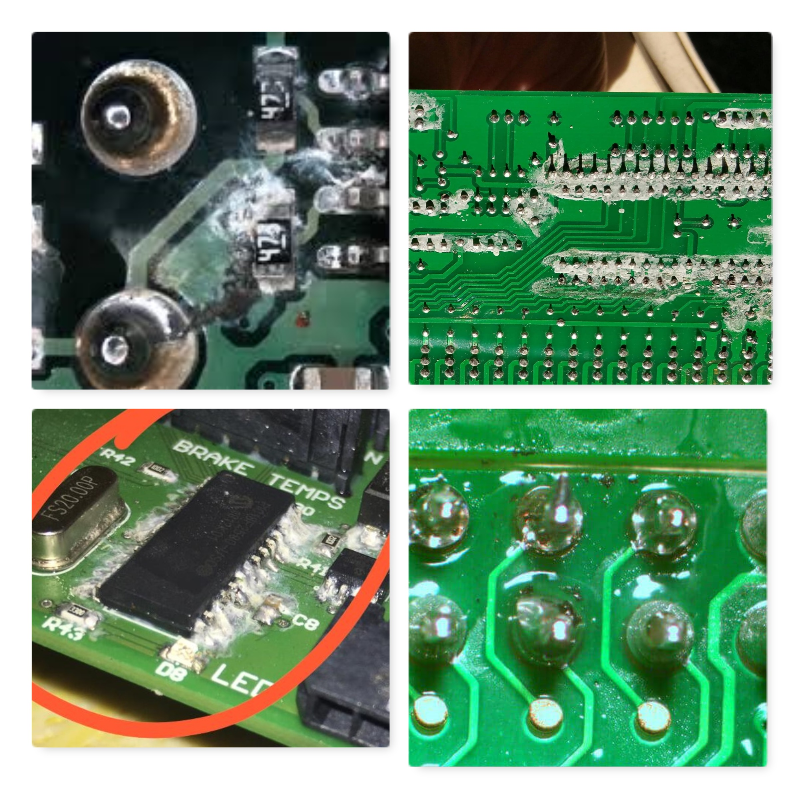 This photos shows a board with
flux left on it as well as some damage to the solder mask and dry
joints. 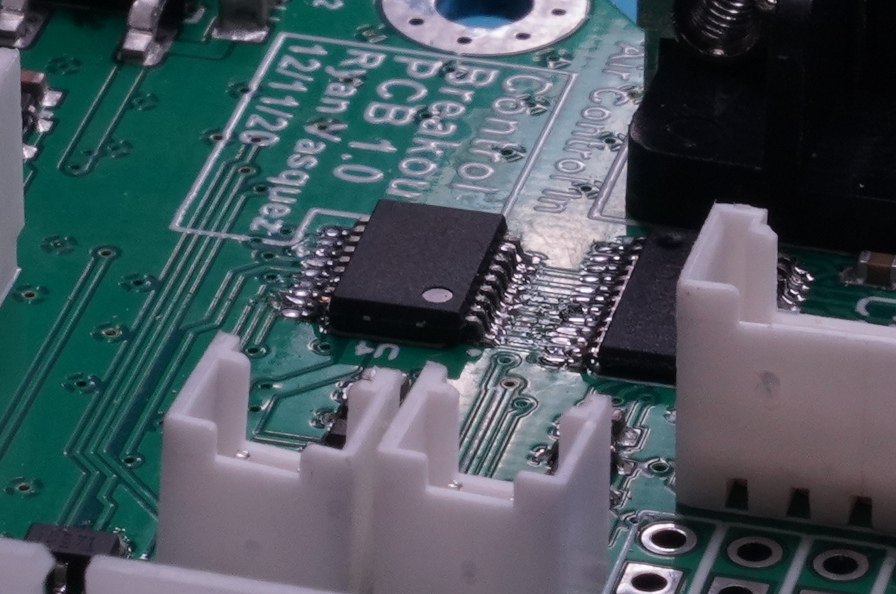 Those
shows the board after flux cleaning.
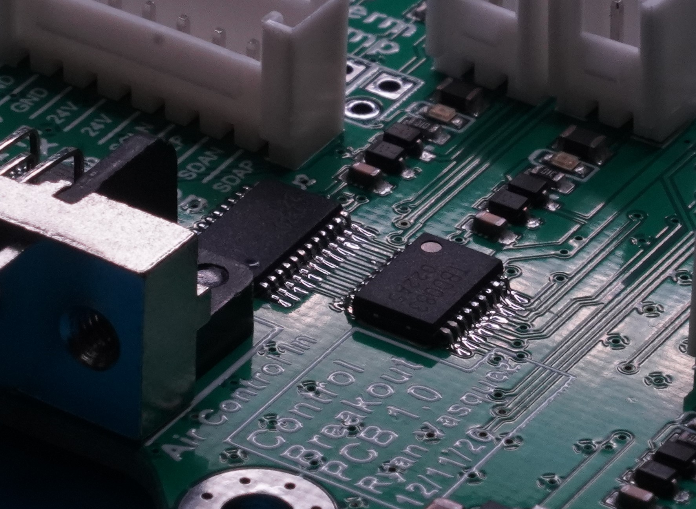

#### Step by Step PCB cleaning. 
1. First step is to clean to PCB in hot water and scrub with toothbrush.
   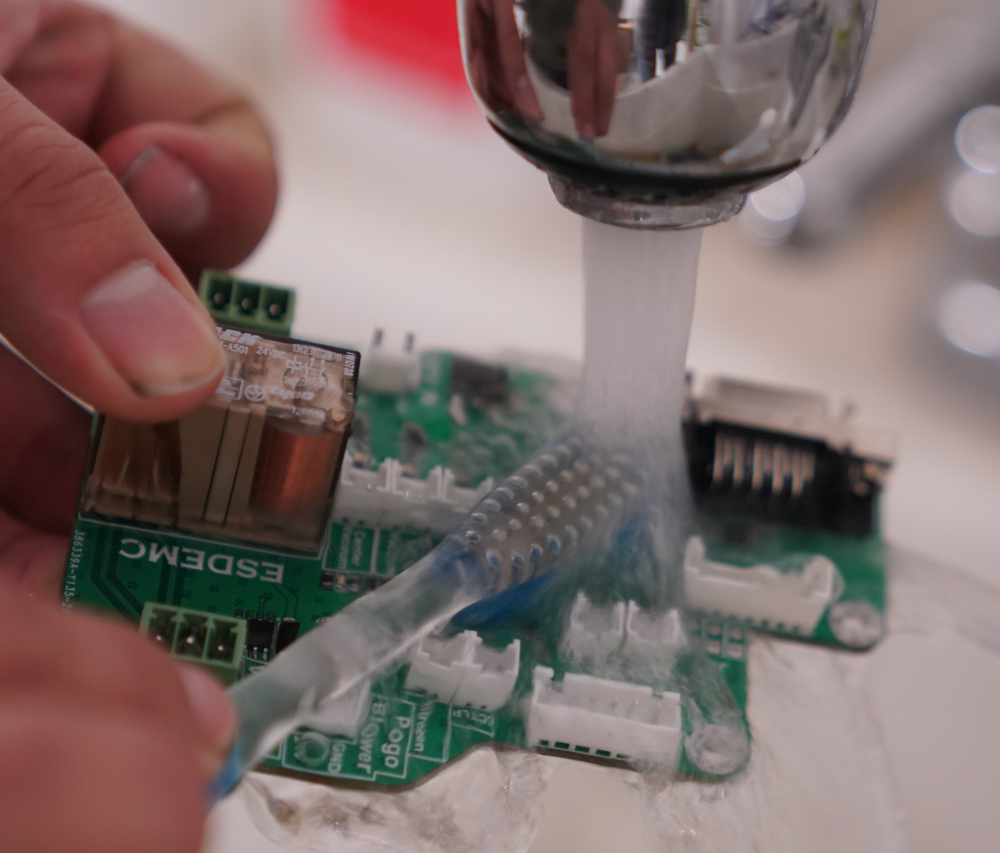
2. Next step is to do alcohol rinse.
   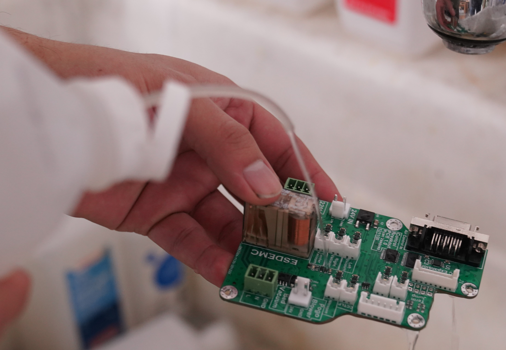
3. Scrub again with alcohol still on PCB.
   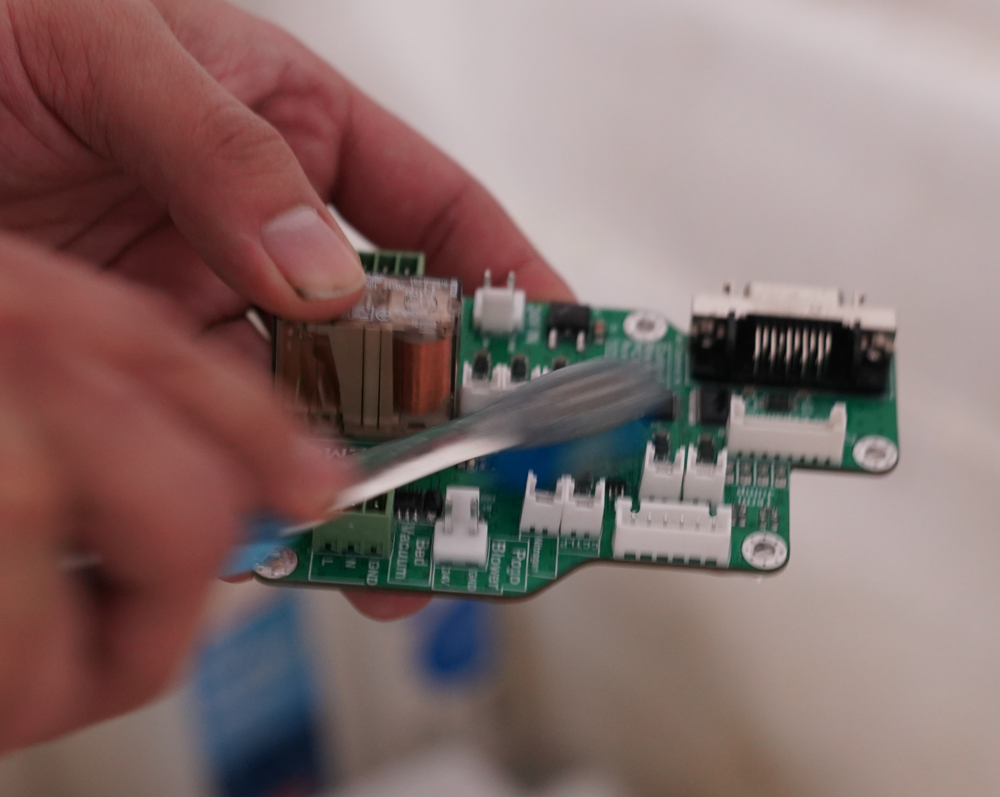
4. Rinse away alcohol with dissolved flux and contamination with more
   alcohol. Repeat steps 2 and 3 until pcb has no more flux if using
   rosin core flux. 
5. Blow dry with compressed air to carry away any contamination
   dissovled in the remaining alcohol. 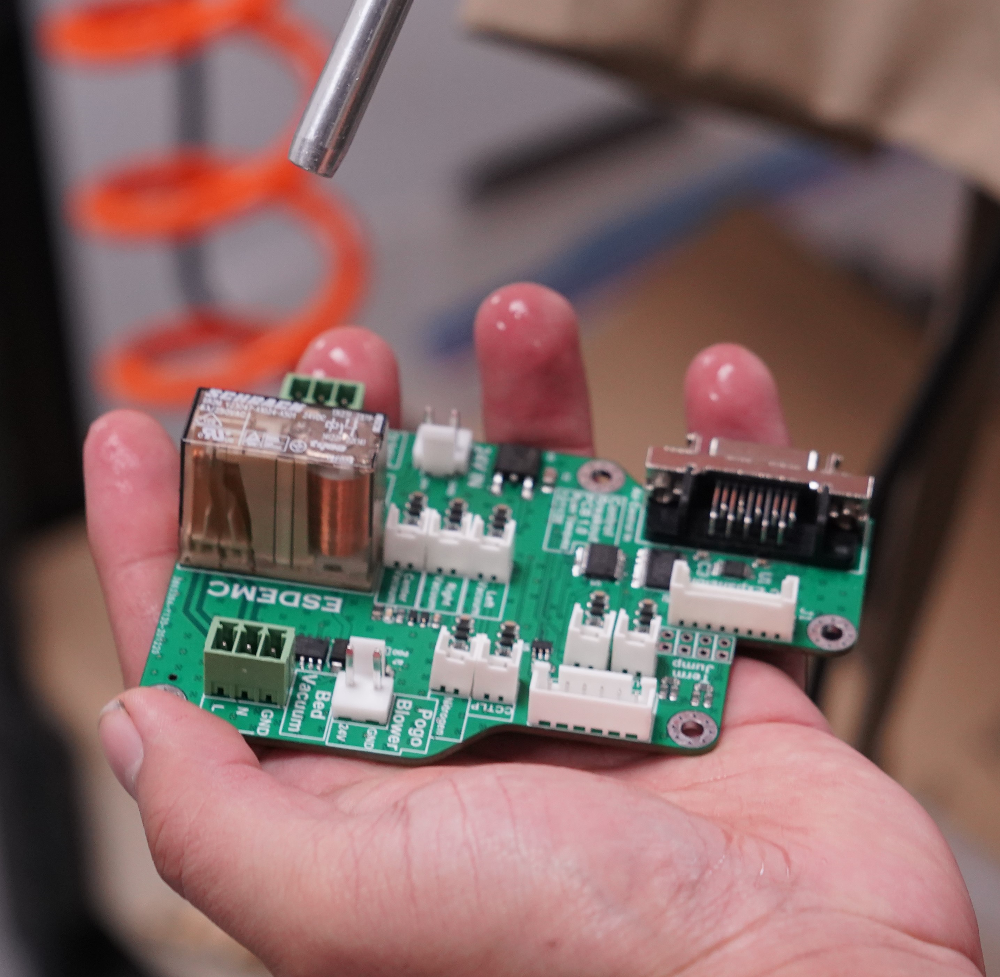
6. Wait 10-30 mins before powering PCB. 

## Soldering Iron Temperature

## Soldering Techniques

### Soldering QFN

### Soldering Examples
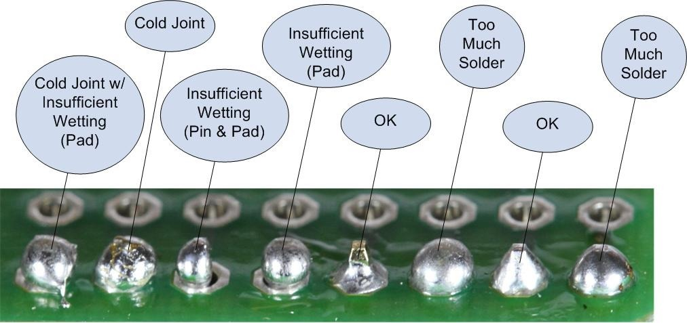

#### Drag Soldering

Drag soldering 

#### Soldering Wetting

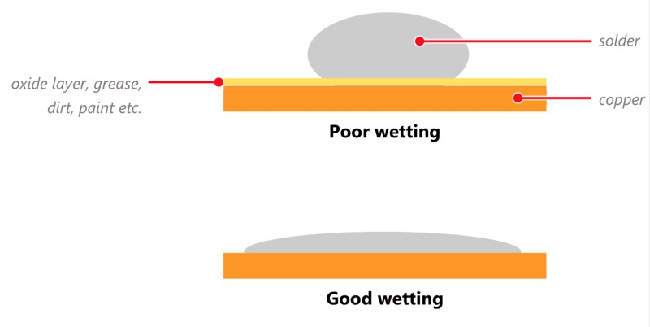

## Glossary

#### SolderMask:

The Green (Or other color) covering the base pcb and copper)

## Credits

